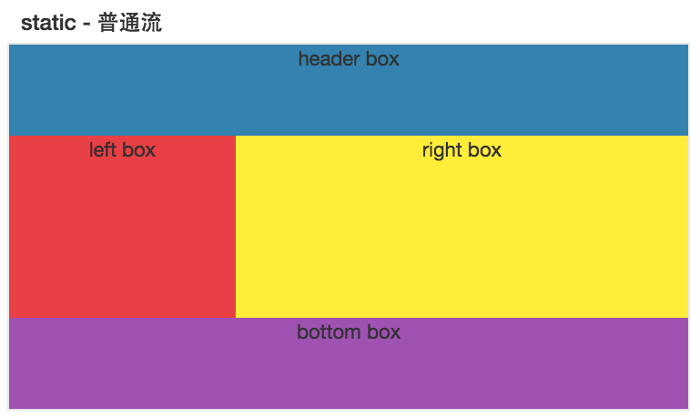
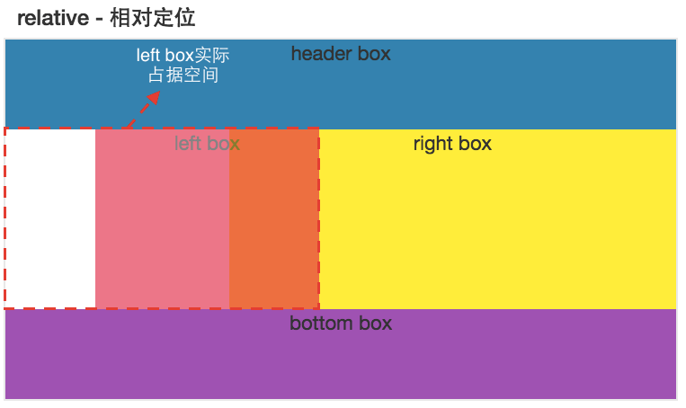
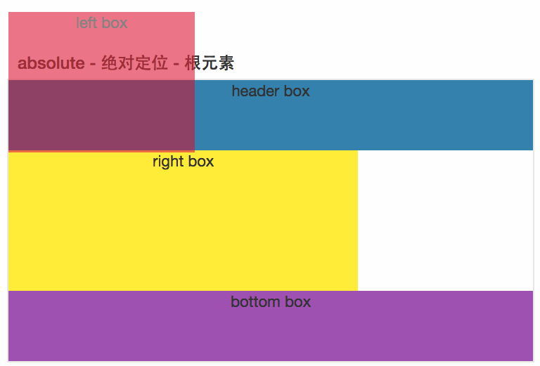
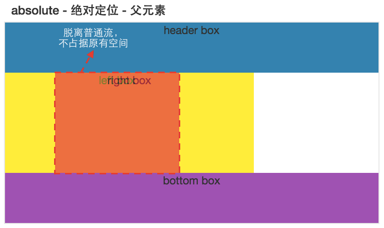
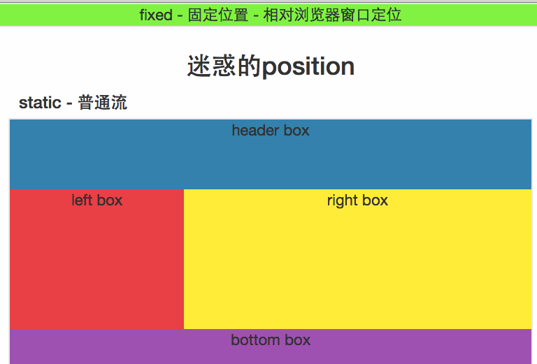

# 迷惑的position
小加发现实际开发中position使用频率很高，但很多人却对position不是很了解，导致开发中出现各种问题，现在让我们一起来看看这个迷惑的position吧~

## static
元素未定位，默认出现在普通流中，即元素从左到右，从上到下的方式布局～

### HTML
```html
  <div class="section">
    <h3 class="section__title">Static - 普通流</h3>
    <div class="section__boxes row text-center">
      <div class="header-box col-xs-12">
        header box
      </div>
      <div class="left-box col-xs-4">
        left box
      </div>
      <div class="right-box col-xs-8">
        right box
      </div>
      <div class="bottom-box col-xs-12">
        bottom box
      </div>
    </div>
  </div>
```

### CSS
```css
  .section {
    margin-bottom: 100px;
  }
  .section__boxes {
    font-size: 22px;
  }
  .header-box {
    background-color: #0981B2;
    height: 100px;
  }
  .left-box {
    background-color: #FF002D;
    height: 200px;
  }
  .right-box {
    background-color: #FFF419;
    height: 200px;
  }
  .bottom-box {
    background-color: #B037B2;
    height: 100px;
  }
```

### 效果图



## relative
相对于该元素所在普通流的位置进行定位，现在我门让`left box`相对于其位置向右边移动`100像素`。

### CSS
```css
  .section--relative > .left-box {
    position: relative;
    left: 100px;
  }
```

### 效果图
对比static和relative两个效果图，你可以看到`left box`确实是相对于其所在正常流位置进行定位，向右移动了`100像素`。




## absolute
相对于**static**定位以外的第一个父元素进行定位，即相对于第一个非处于正常流的父元素定位，现在我们将`left box`设置为`absolute`，并且向下移动`1150像素`。

### CSS
```css
  .section--absolute > .left-box {
    position: absolute;
    top: 1150px;
  }
```

### 效果图
由于查找`left box`的祖先元素中，未发现有设置非`static`的元素，其绝对定位是**相对于根元素**进行移动的。



---
### relative和absolute对比
### CSS
我们设置其父亲元素为`relative`，然后让其元素向下、右各移动`100像素`。

```css
  .section--absolute {
    position: relative;
  }
  .section--absolute > .left-box {
    position: absolute;
    top: 100px;
    left: 100px;
  }
```

### 效果图
由于其父元素设置了`relative`，此时该元素是相对于其父亲进行定位的，而非根元素了～

我们再对比下relative和此时的效果图，你会发现`left box`的实现效果一致，但是`right box`却有一点不一样。这是因为当元素设置`relative`时，其元素依然会<mark>占据所在普通流的的位置</mark>，而`absolute`会<mark>脱离普通文档流</mark>，此时`right box`就往左边布局了。




## fixed
不管浏览器内容怎么滚动等操作，都是相对于**浏览器窗口**进行定位，即固定位置。我门将元素固定在浏览器的顶部。

### HTML
```html
  <div class="section">
    <div class="section__boxes section-fixed row text-center">
      <p>fixed - 固定位置 - 相对浏览器窗口定位</p>
    </div>
  </div>
```

### CSS
```css
  .section-fixed {
    position: fixed;
    top: 0;
    right: 0;
    left: 0;
    background-color: #15FF44;
  }
  .section-fixed > p {
    margin: 0;
  }
```

### 效果图
你可以看到随着浏览器滚动，其元素的位置依然在浏览器窗口的顶部，未发生任何变化。



## 关键知识点
> | value | description |
> |:------|:------------|
> | static | 默认值。没有定位，元素出现在<mark>正常的流中</mark>（忽略 top， bottom， left， right 或者 z-index 声明）。 |
> | relative | 生成相对定位的元素，<mark>相对于**其正常位置**</mark>进行定位。因此，"left:20" 会向元素的 LEFT 位置添加 20 像素。 |
> | absolute | 生成绝对定位的元素，<mark>相对于**static**定位以外</mark>的第一个父元素进行定位。元素的位置通过 "left"， "top"， "right" 以及 "bottom" 属性进行规定。 |
> | fixed | 生成绝对定位的元素，<mark>相对于**浏览器窗口**</mark>进行定位。元素的位置通过 "left"， "top"， "right" 以及 "bottom" 属性进行规定。 |
> | inherit | 规定应该从<mark>父元素继承</mark> position 属性的值。 |
>>w3school

## 资源
### [在线测试](http://ipluser.github.io/speechless/public/view/css/position.html)
### [源代码](https://github.com/ipluser/speechless/blob/gh-pages/public/view/css/position.html)